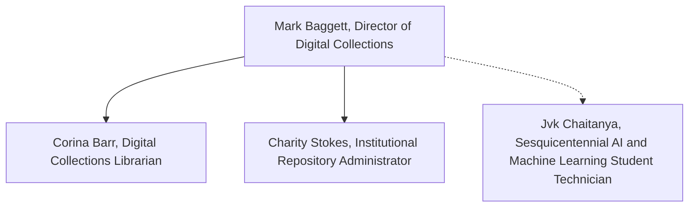

# 🧪 TAMULib DC Labs

TAMULib DC Labs is the experimental development space for the Texas A&M University Libraries Digital Collections Department.

This org hosts our docs, prototype applications, small utilities, and research code exploring new ideas in digital collections, digital preservation, and scholarly communication.

## 🧑‍💻 Who We Are

* [Mark Baggett](https://github.com/markpbaggett), Director of Digital Collections
* [Corina Barr](https://github.com/cbarr5), Digital Collections Librarian
* Charity Stokes, Institutional Repository Administrator

### Alumni 

* [Nithin Bazaru](https://github.com/bvsnithin), Institutional Repository Student Technican

## 💼 What We Do

The Digital Collections Department at Texas A&M University Libraries stewards the university’s institutional repository, cultural heritage collections, digital exhibits, and open access journals.

We help faculty, students, and researchers share, publish, and preserve their work openly and ethically, supporting the principles of open scholarship and long-term access.

Our work also connects people with the university’s rich digital resources by helping audiences discover, explore, and engage with Texas A&M’s collections in new and meaningful ways.

## 🚀 About

This GitHub organization (tamulib-dc-labs) serves as a sandbox for experimentation and collaboration.

Code in this organization may be unstable, in-progress, or deprecated.

## 📚 Documentation

Most of our documentation is available on our [Docs Site](https://tamulib-dc-labs.github.io/docs/).

## 🌐 Microsites

* [Edge Grant Reviewer](https://tamulib-dc-labs.github.io/edge-grant-reviewer/): A Vite Static site for editing and reviewing historic oral history transcripts generated by Whisper X using media streamed from Avalon and Kaltura.
* [Docs](https://tamulib-dc-labs.github.io/docs/): All our public docs related to the various applications we work on.
* [Sesquicentennial Planning](https://tamulib-dc-labs.github.io/sesquicentennial-planning/): A Canopy Exhibit for thinking about our Sesquicentennial Celebration

## ⚙️  Applications and Experiments

* [pyavalon](https://github.com/tamulib-dc-labs/pyavalon): A somewhat bespoke utility for utilizing the Avalon API for common tasks related to repository management
* [tamu-id-minter](https://github.com/tamulib-dc-labs/tamu-id-minter): A helper utility for minting many types of permanent identifiers
* [tamu-whisper](https://github.com/tamulib-dc-labs/tamu-whisper): A utility for generating VTTs with Whisper and adding metadata to the resulting VTT

## 🧾 License

Unless otherwise noted, projects are released under the MIT License.

Refer to individual repositories for specific license details.

